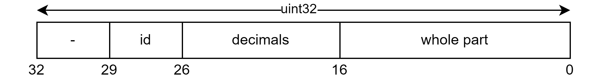

# Dataset

The protobuf definition can be found [here](../../schemas/dataset.proto).

Only the required fields are kept:

- `start_time`: The moment at which the values where measured, expressed as a [datetime](../datetime/datetime.md).
- `data`: Array of [compressed values](#data-compression) obtained.

## Data compression

Protobufs allow to easily store data as binary but do not offer as much compression as required for this particular use case.
To optimize the available space, each measured value is encoded in the following manner.



The required bits are obtained according to the potential stored values. ([Reference](https://github.com/SAMuCaptE/loch/blob/main/tests/fuzz/sensor_scheduler.fuzz.md#intervalles-r%C3%A9els))

|            | Max value | Bits                                |
| ---------- | --------- | ----------------------------------- |
| sensor id  | 8         | $log_2(8)=3$                        |
| decimals   | 999       | $\lceil{ log_2(999) }\rceil = 10$   |
| whole part | 55000     | $\lceil{ log_2(55000) }\rceil = 16$ |

## Size analysis

> All calculations were made using [protobufpal.com](https://www.protobufpal.com/).

Both of the following cases would fit in 250kB of memory. However, the worst case is much riskier if the experimentation period is longer.
The second case would not pose any problems and could allow to store more metadata.

#### Worst case

If every sensor is **activated independently**, more overhead is added to store an array of length one. This would mean that a _single_ value would use 11 bytes of storage.

**Required space for a year:**

$$
365\text{ days } \times 6\text{ values/sensor/day } \times 8\text{ sensors } \times 11\text{ bytes/value } = 192720\text{ bytes }
$$

**Input:**

```json
{
  "start_time": 1710424263,
  "data": [4000000]
}
```

#### Ideal case

If all sensors are **activated at the same time**, a dataset would use 40 bytes.

**Required space for a year:**

$$
365\text{ days } \times 6\text{ datasets/day } \times 40\text{ bytes/dataset} = 87600\text{ bytes }
$$

**Input:**

```json
{
  "start_time": 1710424263,
  "processing_time": 200,
  "data": [
    4000000, 4000000, 4000000, 4000000, 4000000, 4000000, 4000000, 4000000
  ]
}
```
