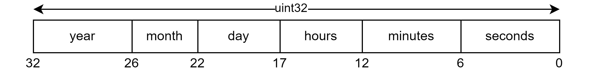

# Datetime

Datetimes do not have a protobuf definition since they are stored as a single integer.

## Data compression

Every required field to properly define a datetime is stored in a single integer in the following manner.

The required bits are obtained according to the potential stored values.

|         | Min | Max | Bits                            |
| ------- | --- | --- | ------------------------------- |
| year\*  | 0   | 63  | $\lceil{ log_2(63) }\rceil = 6$ |
| month   | 1   | 12  | $\lceil{ log_2(12) }\rceil = 4$ |
| day     | 1   | 31  | $\lceil{ log_2(31) }\rceil = 5$ |
| hours   | 0   | 23  | $\lceil{ log_2(23) }\rceil = 5$ |
| minutes | 0   | 59  | $\lceil{ log_2(59) }\rceil = 6$ |
| seconds | 0   | 59  | $\lceil{ log_2(59) }\rceil = 6$ |

##### Note \*

It is important to notice that the year field has been truncated. Assuming an offset of +2000 as [suggested by STM32](https://www.disca.upv.es/aperles/arm_cortex_m3/llibre/st/STM32F439xx_User_Manual/stm32f4xx__hal__rtc_8h_source.html#l00135),
there is still quite a bit of time until the proposed datetime format expires.
